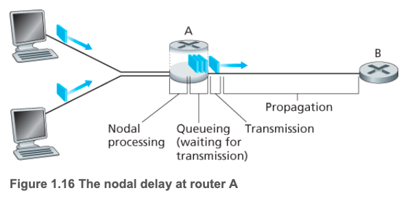
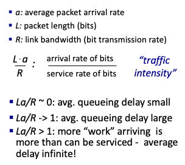

### 1.4.1 Overview of Delay in Packet-Switched Networks

A packet travels from one node (host or router) to the subsequent node (host or router) along this path, the packet suffers from several types of delays at each node along the path.

The most important of these delays are the **nodal processing delay, queuing delay, transmission delay, and propagation delay**; together, these delays accumulate to give **a total nodal delay.**

#### Type of Delay

As part of its end-to-end route between source and destination, a packet is sent from the upstream node through router A to router B. Our goal is to characterize the nodal delay at router A.

Note that router A has an outbound link leading to router B. This link is preceded by a queue (also known as a buffer). When the packet arrives at router A from the upstream node, router A examines the packet’s header to determine the appropriate outbound link for the packet and then directs the packet to this link.

In this example, the outbound link for the packet is the one that leads to router B. A packet can be transmitted on a link only if there is no other packet currently being transmitted on the link and if there are no other packets preceding it in the queue; if the link is currently busy or if there are other packets already queued for the link, the newly arriving packet will then join the queue.

#### Processing Delay

The time required to examine the packet’s header and determine where to direct the packet is part of the processing delay.

#### Queuing Delay

At the queue, the packet experiences a queuing delay as it waits to be transmitted onto the link. The length of the queuing delay of a specific packet will depend on the number of earlier-arriving packets that are queued and waiting for transmission onto the link.

If the queue is empty and no other packet is currently being transmitted, then our packet’s queuing delay will be zero. On the other hand, if the traffic
is heavy and many other packets are also waiting to be transmitted, the queuing delay will be long.

#### Trasmission Delay

Assuming that packets are transmitted in a first-come-first-served manner, as is common in packet-switched networks, our packet can be transmitted only after all the packets that have arrived before it have been transmitted.

Denote the length of the packet by L bits, and the rate of Ethernet link is R, then the transmission delay is L/R. This is the amount of time required to push (that is, transmit) all of the packet’s bits into the link.

#### Propagation Delay (전파)

Once a bit is pushed into the link, it needs to **propagate** to router B. The time required to propagate from the beginning of the link to router B is the propagation delay.

### 1.4.2 Queuing Delay and Packet Loss

Unlike the other three delays (namely, dproc, dtrans, and dprop), the queuing delay can **vary from packet to packet**.

For example, if 10 packets arrive at an empty queue at the same time, the first
packet transmitted will suffer no queuing delay, while the last packet transmitted will suffer a relatively large queuing delay (while it waits for the other nine packets to be transmitted).

Therefore, when characterizing queuing delay, one typically uses statistical measures, such as average queuing delay,nvariance of queuing delay, and the probability that the queuing delay exceeds some specified value.

When is the queuing delay large and when is it insignificant?

The answer to this question depends on the rate at which traffic arrives at the queue, the transmission rate of the link, and the nature of the arriving traffic, that is, whether the traffic arrives periodically or arrives in bursts.

##### Tracffic Intensity

Typically, the arrival process to a queue is **random**; that is, the arrivals do not follow any pattern and the packets are spaced apart by random amounts of time. In this more realistic case, the quantity La/R is not usually sufficient to
fully characterize the queuing delay statistics.

#### Packet Loss

Since the queue capacity is finite, packet delays do not really approach infinity as the traffic intensity approaches 1. Instead, a packet can arrive to find a full queue.

With no place to store such a packet, a router will **drop** that packet; that is, the packet will be **lost**.

From an end-system viewpoint, a packet loss will look like a packet having been transmitted into the network core but never emerging from the network at the destination. The fraction of lost packets increases as the traffic intensity increases.

Therefore, performance at a node is often measured not only in terms of delay, but also in terms of **the probability of packet loss.**

### 1.4.4 Throughput in Computer Networks

Throughput is a rate at wuch bits are being sent from sender to receiver.

한 마디로 성능이다. 단위시간 동안 sender와 receiver가 교환된 데이터 양을 말한다. Throughput은 link의 bandwidth가 고정되었따 하더라고, 망 상태에 따라 (사용자가 얼마나 몰렸는가) 달라지기도 한다.

- Instantaneous Throughput: rate at given point in time
- Average Throughput: rate over longer period of time

##### Bottleneck Link

네트워크의 각 link의 capacity가 다를 수 있다. 이런 상황에서 자기가 가지고 있는 capacity를 낭비하거나 패킷이 버려진다. 

이런 경우, 가장 좁은 길을 파악해서 그 좁은 길의 용량만큼 보내야 한다. 이 **가장 좁은 길** (가장 성능이 낮은 link)을 bottlenect 이라고 한다.
