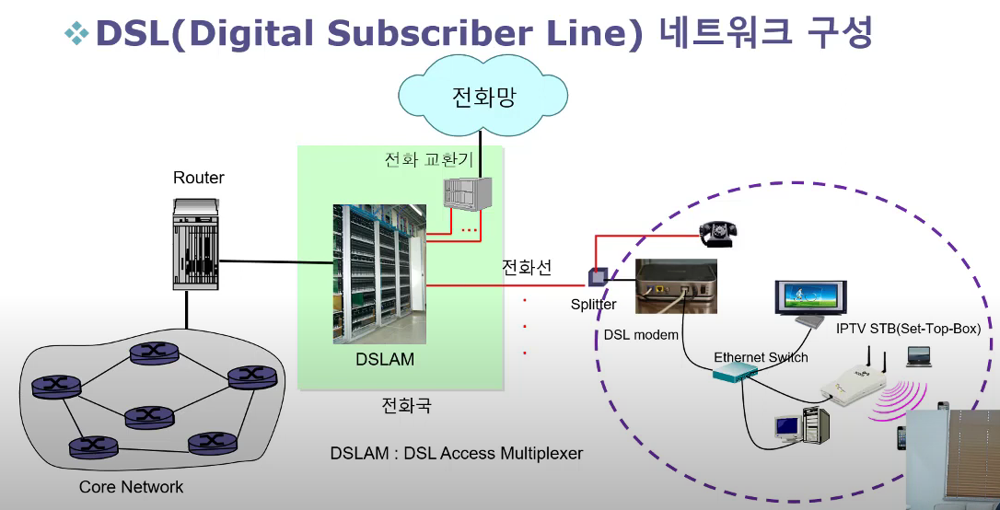

# 네트워크 엣지 (Access Network)

## Home Access Network

집에서 구축한 네트워크라고 하고 자체적으로 네트워크를 운영하지 못하기 때문에 ISP에 네트워크를 요청해서 사용한다.
ex) DSL, Cable, FTTH, 이더넷(유선)/Wifi(무선)
보통 DSL을 많이 사용한다.
FTTH 광 케이블을 직접 집까지 연결한 네트워크를 의미

## Enterprise Access Network

네트워크를 구축하고 운영하고 서비스를 제공할 수 있는 조직에서 운영하는 네트워크를 의미한다.
대부분 랜을 구축해서 사용한다. (이더넷/Wifi)

## 네트워크 엣지

인터넷에 최종 사용자 단말기(호스트)가 연결되는 부분을 의미한다.
네트워크 엣지를 Access Network라고 한다.

### DSL

