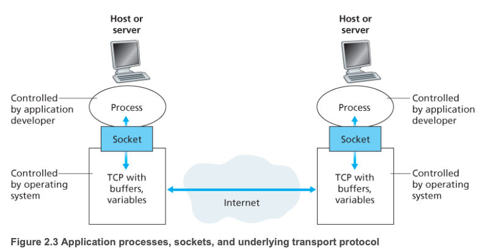

## 네트워크 어플리케이션의 구조

어플리케이션 구조는 어플리케이션 개발자가 설계하고 여러 종단 시스템이 어떻게 조직 되어있는지를 알려준다. 

### 1. 클라이언트-서버 구조

서로 종단 시스템끼리 메세지를 주고 받으면서 통신하는걸 의미한다. 

요청을 보내는쪽을 클라이언트라고 하고 요청을 받는쪽을 서버라고 한다. 그래서 서버가 클라이언트가 되기도 할 수 있다. 

- 항상 동작하고 있는 컴퓨터 즉 서버가 존재하고 매번 클라이언트로 부터 요청을 받는다. 
- 클라이언트 끼리는 통신하지 못한다. 
- 서버는 고정 IP주소를 가진다. 

### 2. P2P 구조

대표적으로 토렌트를 생각해보면 쉽다. 
정해진 서버가 존재하는게 아닌 토렌트 정보를 받은 컴퓨터가 서버의 역할을 하며 다른 사용자가 내 컴퓨터에서 다운을 받게 되면 해당 사용자 컴퓨터도 서버의 역할을 해준다. 이 때 각 서버를 피어라고 한다. 

- 데이터 센터가 필요없기 때문에 비용측면에서 효율적이다. 

## 소켓이란?

소켓은 어플리케이션 계층과 트렌스포트 계층간에 연결을 지원해주는 인터페이스이다. 

## 트랜스포트 계층

인터넷을 포함한 많은 네트워크는 자체적인 트랜스포트 프로토콜을 하나이상 가지고 있다. 
TCP, UDP등등 

그럼 이 트랜스포트 계층에 있는 프로토콜이 제공해주는 요소에 대해서 알아보자.

- 신뢰성
- 처리율
- 시간
- 보안

### 인터넷 전송 프로토콜이 제공하는 서비스

#### 1. TCP 프로토콜

- 연결 지향형 서비스
  3-way-handshake를 통해서 클라이언트와 서버의 연결이 되어있음을 알려준다. 
  이를 통해 통신의 안정성을 보장해준다. 하지만 추가적인 네트워크 처리가 필요하기 때문에 네트워크 리소스를 사용한다는 단점이 존재한다. 
- 패킷 순서 보존
  잘게 나눈 패킷이 네트워크를 통해서 가는데 매번 패킷마다 보내서 가는 경로가 다르기 때문에 순서에 맞지 않게 도착할 수 있다. 이를 보완해주는게 TCP 프로토콜이다.
- 혼잡 제어 방식

#### 2. UDP 프로토콜

비연결 지향 프로토콜이다. 
그래서 handshake 과정이 없고 이 때문에 정보의 손실이 발생할 수 있지만 추가적인 네트워크 과정이 없어서 속도는 빠를 수 있다.

대표적으로 실시간 스트리밍이나 DNS 요청같은 경우를 예로들 수 있다.

## 어플리케이션 계층 프로토콜

대표적으로 HTTP, FTP, SMTP 등이 있다.
같은 프로토콜 끼리만 통신이 가능하다. 

