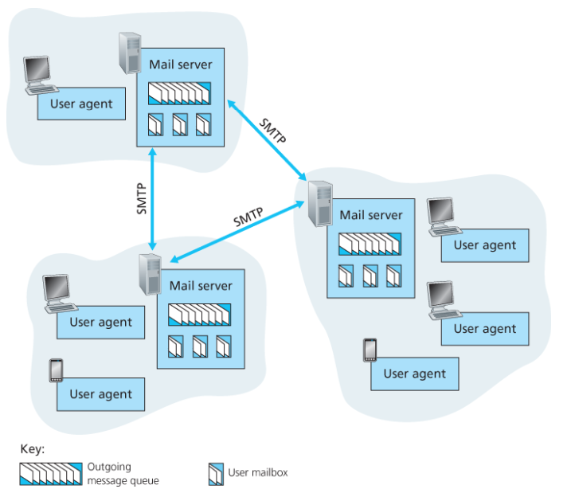

# 인터넷 전자메일

## User Agent

사용자가 메세지를 읽고, 응답하고, 전달하고, 저장하고 구성하게 해준다. 
한 마디로 메일을 볼수있고 송신할 수 있는 프로그램이라고 보면 될꺼같다. 

## 메일 서버

각각의 수신자는 메일 서버에 메일 박스를 갖고있다. 이 메일 박스에는 수신자의 메세지를 유지하고 관리한다.
송신자가 메세지를 보낼 때 송신자의 유저 에이전트에서 시작해서 송신자의 메일 서버를 거치고 수신자의 메일 서버를 거쳐서 수신자의 유저 에이전트에 도착하게 된다. 
이 때 메일 박스에 있는 메세지를 확인하기 위해서는 사용자는 아이디와 비번을 이용해서 사용자임을 인증해야한다. 

만약에 메일을 수신자의 메일 서버에 보낼 수 없다면 이를 메세지 큐에 보관하고 약 30분마다 재시도를 한다. 계속 실패할 시 그 메세지를 제거하고 송신자에게 통보한다. 

한번 메일 박스에 도착하면 사용자는 언제든지 해당 메일박스를 확인할 수 있다.

## SMTP

인터넷 전자메일을 위한 주요 어플리케이션 계층의 프로토콜이다. 

- 클라이언트 서버 구조를 갖고 있다.
- TCP 프로토콜을 기반으로 신뢰성 있는 정보를 교환한다. 
- 서버 클라이언트가 나뉘어 있지 않고 모두가 클라이언트가 될수도 있고 서버가 될 수도 있다.

# SMTP 프로토콜

모든 메일에 몸체는 7 bit여야 한다. 그래서 전송 용량이 있는 파일의 경우에는 다른 추가적인 방법으로 송신을 해야한다. 

참고로 SMTP는 두 사용자간에 메일 서버의 거리가 멀더라도 중간에 있는 메일 서버를 거치지 않고 곧바로 송신된다.

참고로 TCP 프로토콜에 의존하는데 이 때 지속 연결을 통해 통신한다. 