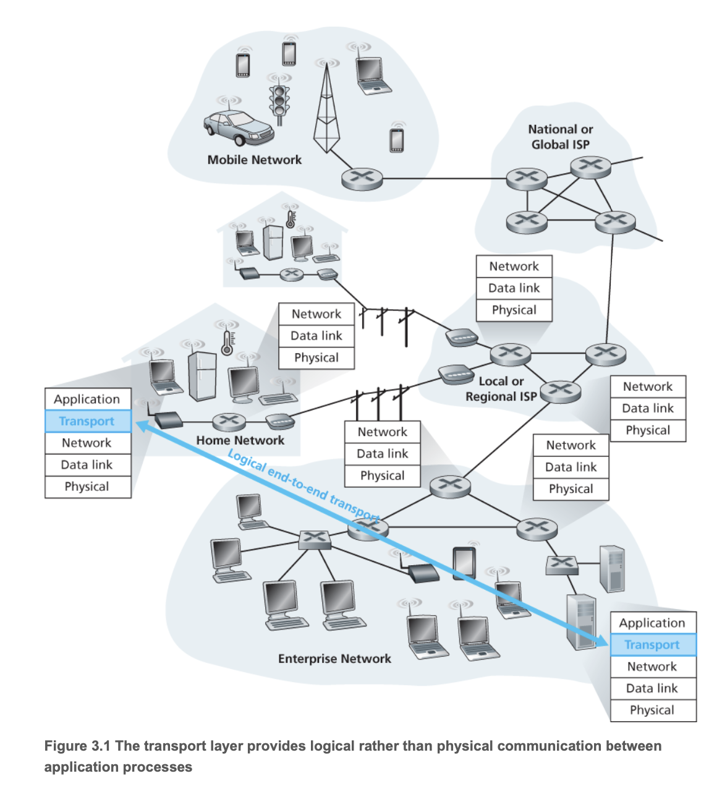

## Overview

A trnsport-layer protocol provides for **logical communication** between application process running on different hosts.

By *logical communication*, we mean that from an application's perspective, it is as if the hosts running the processes were directly connected; in reality, the hosts may be on apposite sides of the planet, connected via numerous routers and a wide range of link types.

Application processes use the logical communication provided by the transport layer to send messages to each other, free from the worry of the details of the physical infrastructure used to carry these messages.

- Whereas transport-layer protocols are implemented in the end systems but not in network routers.
- The transport layer converts the application-layer messages it receives from a sending application process into transport-layer packets, known as **segments** in Internet terminology.

  - This is done by breaking the application messages into smaller chunks and *adding a transport-layer header* to each chunk to create the transport-layer segment.
  - Transport layer then passes the segment to the network layer at the sending end system, where the segment is encapsulated within a network-layer packet (a datagram) and sent to the destination.
  - On the receiving side, the network layer extracts the transport-layer segment from the datagram and passes the segment up to the transport layer.
  - The transport layer then processes the received segment, making the data in the segment available to the receivng application.

### 3.1.1 Relationship Between Transport and Network Layers

Whereas a trasnport-layer protocol provides logical communication between **processes** running on different hosts, a network-layer protocol provides logical communication between **hosts**.

Certain services can be offered by a transport protocol even when the underlying network protocol doesn't offer the corresponding service at the network layer, such as network protocol loses, garbles, or duplicates packets.
