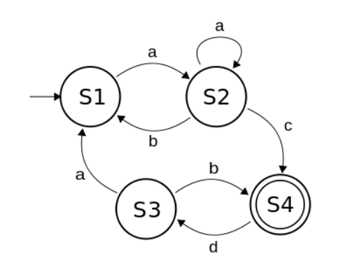
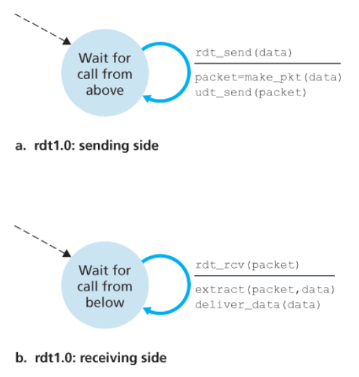
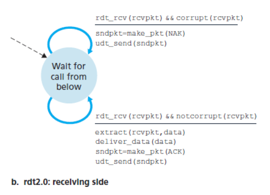
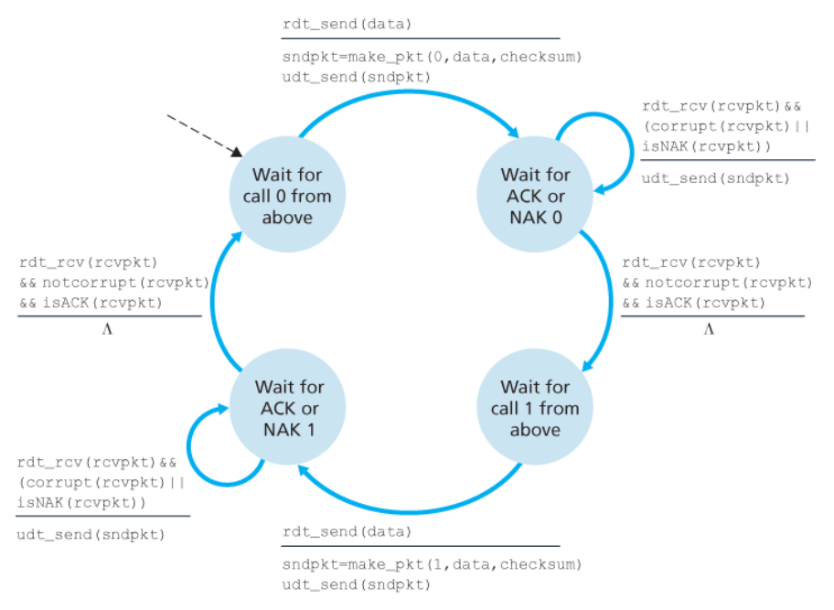

# 신뢰적 데이터 전송

신뢰적 데이터의 전송은 두가지를 보장한다.
- 전송된 데이터가 손상되거나 손실되지 않는다.
- 모든 데이터는 순서대로 전달된다.

## 신뢰적인 데이터 전달 프로토콜 구축

신뢰성있는 데이터 교환을 의미하는 RDT에 대해서 설명해보려고 한다.

FSM용어가 자주 나오는데 FSM은 각 state가 유한하게 있고 state를 전이시키는 조건이 있는데 이를 표현하는 방법이라고 한다. 조건문등을 이용해서 표현이 가능하다.

### RDT 1.0

하위 채널이 완전히 신뢰적인 경우이다. 

위 그림을 보면 송신자와 수신자가 완전히 분리되었음을 볼 수 있다.
즉 하나의 상태만 가지고 그 상태는 필연적으로 자신에게 돌아온다. 

이럼 이벤트가 발생하면 다른 조건을 따지지 않고 바로 자기자신에게 반영이 된다는걸 알 수 있다.

### RDT 2.0

패킷안의 비트들이 하위 채널에서 손상되는 경우이다. 
보통 패킷이 전파되거나 버퍼링 될때 물리적인 구성요소에 의해 발생한다. 

#### ARQ(자동 재전송 요구) 프로토콜

패킷이 손상이 될 수 있기 때문에 수신자가 송신자에게 정확하게 수신이 되었는지 수신이 안되었으면 재송신해야 하는지를 알려주는 프로토콜이다.

#### 송신자

rde2.0에 FSM은 두가지 상태가 존재한다. 
1. 일단 왼쪽 상태는 상위 계층으로부터 데이터의 전달을 기다린다. 
2. 이제 데이터를 받아 rdt_send 이벤트가 발생하면 패킷 sndpkt를 생성한다.
3. 생성된 패킷을 udt_send(sndpkt) 동작을 통해 전송한다.
4. 오른쪽 상태에서는 ACK, NAK 패킷을 기다린다. 
5. ACK 패킷이 수신되면 rdt_rcv(rcvpkt) && isACK(rcvpkt) 이벤트가 실행된다.
  이는 최근에 전송된 패킷이 정확하게 수신되었음을 의미한다. 
  그래서 다시 왼쪽 상태로 돌아간다. 
6. NAK 패킷이 수신되면 정상적인 패킷이 아니므로 마지막 패킷을 재전송한다.

이 과정은 오른쪽 상태가 완료가 되기전까지 상위 계층에서 데이터를 받아오지 않는다.

#### 수신자

수신자는 단일 상태를 갖는다. 
패킷이 도착했을때 패킷의 손상 여부에 따라 ACK 나 NAK로 응답한다.

하지만 rdt2.0은 ACK, NAK 패킷의 손상될 가능성은 고려하지 않는다.
수신측에서 보낸 피드백이 에러가 발생하거나 손실 되었을때 송신측은 NAK 데이터를 재 전송한다. 하지만 수신측에서는 이게 재선송한건지 다음 순서의 데이터를 보낸건지 알지 못한다.

## RDT 2.1

rdt2.0은 단점을 보완하기 위한 방법이다.

위 그림은 송신측과 수신측의 FSM이다.

일단 패킷마다 시퀀스 번호 0, 1을 붙혀서 송수신한다.
0 패킷을 보낸다고 치면 0 ACK or 0 NAK 피드백을 기다린다. 
정상적으로 0 ACK를 받았다면 1번 패킷을 전송한다. 
0 NAK응답이나 에러가 생겼을땐 0번 패킷을 재전송한다. 
수신측에서는 다시 받게 되면 기존 데이터는 자체적으로 지우고 받는다. 

이를 통해서 RDT2.0에 재전송된 데이터인지 아닌지에 대한 판단은 시퀀스 번호로 확인이 가능하게 됐다. 

## RDT 2.2

RDT 2.1에서 NAK를 뺀 버전이라고 보면된다. 
에러가 있다면 다른 시퀀스 번호로 표시해서 응답한다.

## RDT 3.0

기존 2.2 버전에서 타이머가 추가된 버전이라고 보면된다.
즉 데이터를 보내고 일정시간 내에 피드백이 오지 않으면 재전송을 한다.

하지만 이 방법은 단점이 있는데 timeout을 너무 짧게 보내면 네트워크 요청이 많아져 비용이 증가할 수 있고 시간을 너무 길게 잡으면 중간에 문제가 생겼을때 서비스가 반응할 때까지 시간이 오래걸려 사용자 경험에 좋지 않을 수 있다. 

이 방법을 위해서 파이프라인 기법을 적용했다. 
파이프라인은 비동기적으로 동작하는거처럼 하는게 가능한 방법인데

확인 응답을 기다리기전에 송신자가 여러개의 패킷을 전송하도록 허용한다면 그만큼 이용율이 올라갈 수 있게 설계한 방법이다.

# GBN (Go Back N)

GBN 프로토콜은 송신자는 응답을 기다리지 않고 여러 패킷의 전송이 가능하도록 하는 방법이다.
하지만 파이프라인에서 허용된 패킷의 수를 넘지는 않아야한다.
이렇게 제한하는 이유는 흐름제어를 위해서 한다고 보면 된다.

https://www2.tkn.tu-berlin.de/teaching/rn/animations/gbn_sr/

<송신자>
1. 송신자가 첫 패킷을 보내고 타임아웃 타이머를 킨다.
2. 첫 패킷에 대한 응답이 오지 않아도 정해진 N 크기만큼 패킷을 순서대로 보낸다.
3. 정해진 N 크키에 제일 앞에 패킷이 응답으로 오게되면 정해진 N에서 +1만큼 위치를 오른쪽으로 민다. 
4. 윈도우를 이동시킬때 타이머를 재시작한다.
5. 패킷에 대한 응답이 오지 않아서 타임아웃이 되면 지금 위치는 윈도우 시작부터 패킷을 재전송한다.

<수신자>

1. 패킷을 받으면 패킷 순서와 함께 ACK를 송신자에게 응답한다.
2. 마지막으로 K번째 패킷을 받았는데 다음으로 K+2 패킷을 받게 되면 이후에 오는 패킷은 모두 버린다.
3. 그리고 K+1 패킷을 받게 되면 ACK를 응답한다.

## SR 프로토콜 

GBN 프로토콜은 패킷 하나때문에 뒤에오는 많은 패킷들을 불필요하게 재전송하게 한다.

SR 프로토콜은 오류가 발생한 패킷만을 재전송하게 해주는 방법이라고 보면된다.

SR 프로토콜은 수신자도 윈도우를 갖고 있다. 수신측의 윈도우는 패킷을 수신받자마자 이동을 하지만 송신측의 윈도우는 응답을 받아야 이동을 하도록 동작한다.

예를들어보자

송신측 윈도우가 [0 1 2 3]이고 수신측도 마찬가지로 [0 1 2 3]이다.

1. 0번 패킷을 수신측에서 받았을때

[0 1 2 3] [1 2 3 4]

2. 0번 패킷의 ACK를 송신측에서 응답받았는데 1번 패킷을 수신측에서 받지 못했을때

[1 2 3 4] [1 2 3 4]

3. 송신측은 1번 패킷에 대한 응답을 받지 못하고 2번을 받았을때 

[1 2 3 4] [1 2 3 4]

4. 1번 패킷에 타이머가 타임아웃 됐을때 1번패킷을 재전송하고 이를 수신측에서 받았을때

[1 2 3 4] [3 4 5 6]

즉 2번 패킷의 수신정보를 버리지 않고 그대로 활용하는걸 볼 수 있다.