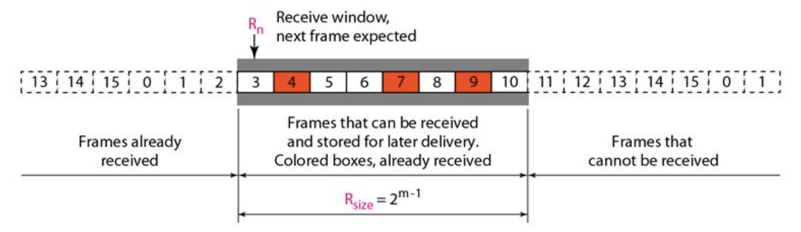
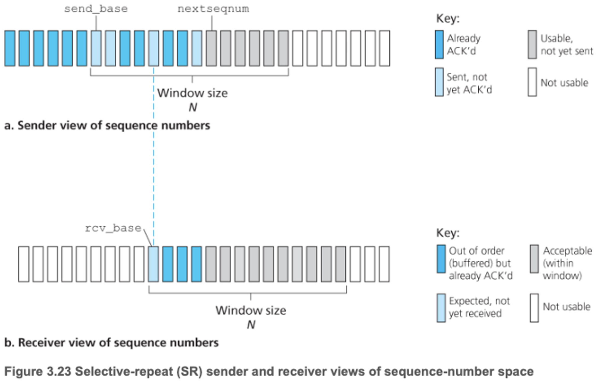

## 목차

[3.4.0 개요](#340-개요)  [3.4.1 신뢰적인 데이터전달 프로토콜의 구축](#341-신뢰적인-데이터전달-프로토콜의-구축)  [3.4.2 파이프라인된 신뢰적 데이터전송 프로토콜](#342-파이프라인된-신뢰적-데이터전송-프로토콜)  [3.4.3 N부터 반복(Go-Back-N, GBN)](<#343-N부터-반복(Go-Back-N,-GBN)>)  [3.4.4 선택적 반복(Selective Repeat, SR)](<#344-선택적-반복(Selective-Repeat,-SR)>) 

## 3.4.0 개요

이 절에서는 일반적인 상황에서의 신뢰성 있는 데이터전송문제를 다룬다. 이는 신뢰적인 데이터전송을 구현하는 문제가 트랜스포트계층 뿐만 아니라 링크계층과 애플리케이션 계층에서도 발생할 수 있는 문제이기 때문이다. 다음 절에서는 TCP를 설명하며 특히 TCP가 많은 원리를 이용한다는 것을 보여준다.

이 절에서는 <u>점점 복잡해지는 하위채널 모델을 고려하는, 신뢰적인 데이터전송 (reliable data transfer, rdt) 프로토콜 송신자와 수신자 측면을 점진적으로 개발해 나갈것이다.</u> 논의하는 과정에서 채택한 한가지 가정은, 보내어진 패킷은 일부 손실될 수도 있겠지만 보내어진 순서대로 전달될 것이라는 것이다. 즉, 하부채널은 패컷의 순서를 바꾸지 않는다는 것이다. 이제부터 프로토콜 데이터 단위에 대해 “세그먼트”보다는 “패킷”이라는 용어를 사용한다. 왜냐면 이 절에서 전개된 이론은 대체로 컴퓨터 네트워크에 적용하는 것이고, 단지 인터넷 트랜스포트계층에만 적용하는것이 아니기 때문이다.

## 3.4.1 신뢰적인 데이터전달 프로토콜의 구축

완전한 신뢰적인 데이터전송 프로토콜에 도달하기 위해 조금씩 더 복잡해지는 일련의 프로토콜들을 알아보자. 

### `완벽하게 신뢰적인 채널`상에서의 신뢰적인 데이터전송: rdt1.0

먼저, 하위채널이 완전히 신뢰적인 가장 간단한 경우를 고려한다. 프로토콜 자체는 단순하며 rdt1.0으로 부르겠다. 신뢰적 데이터전달을 위해 송신자와 수신자는 세그먼트에 대한 상태정보를 기억할 필요성이 있다.

- rdt1.0 송신측

  상위계층으로부터 데이터를 받아들이고 데이터를 포함한 패킷을 생성한다. 그리고 난 후 패킷을 채널로 송신한다.

- rdt1.0 수신측

  하위계층의 채널로부터 패킷을 수신하고, 패킷으로부터 데이터를 추찰한 후 데이터를 상위계층으로 전달한다.

이러한 간단한 프로토콜에서는 데이터단위와 패킷단위의 차이점이 없다. 또한 모든 패킷흐름은 송신자로부터 수신자까지이다. 즉, 완전히 신뢰적인 채널에서는 오류가 생길 수 없으므로 <u>수신측이 송신측에게 어떤 피드백도 제공할 필요가 없다.</u> 또한 수신자는 송신자가 데이터를 송신하자마자 데이터를 수신할 수 있다고 가정했음에 유념해야한다. 따라서 <u>수신자가 송신자에게 “천천히”라는 것을 요청할 필요가 없다.</u>

### `비트 오류가 있는 채널`상에서의 신뢰적인 데이터전송: rdt2.0

전송된 모든 패킷들이 송신된 순서대로 (비록 패킷의 비트가 손상된다고 하더라도) 수신된다고 가정한다. 이러한 채널에서 신뢰적인 통신을 위한 프로토콜을 설명하기 전에 어떻게 사람들이 이러한 상황을 다룰 수 있는지 먼저 생각해보자. 여러분이 전화통화를 할 때 긴 메시지를 어떻게 받아쓸 수 있는지 고려해보자. 일반 시나리오에서 메시지 수신자는 각각의 문장을 듣고, 이해하고 기록한 후에 ‘OK’라고 말할 수 있을 것이다. 만일 메시지 수신자가 문장을 올바로 듣지 못했다면 반복하라고 요청한다. 이러한 프로토콜은 긍정 확인응답 (positive acknowledgement)(”OK”)과 부정 확인응답 (negative acknowledgement)(”반복해주세요”)을 둘 다 사용한다.

수신자의 이러한 피드백을 통하여 송신자는 수신자의 상태를 알 수 있게된다. 컴퓨터 네트워크 설정에서 그러한 재전송을 기반으로 오류를 복구하는 신뢰적인 데이터전송 프로토콜은 자동 재전송 요구 (Automatic Repeat reQuest, **ARQ**) 프로토콜로 알려져있다. 비트오류 처리를 위한 다음의 3가지 기능이 ARQ 프로토콜에 요구된다.

1. 오류검출

   비트오류의 여부를 수신자가 검출할 수 있어야한다. 체크섬 필드는 이 기능을 한다.

2. 수신자의 피드백

   송신자가 수신자의 상태를 알기 위한 유일한 방법은 수신자가 송신자에게 피드백을 제공하는 것이다. 긍정 확인응답(ACK)과 부정 확인응답(NAK)은 그러한 피드백의 예다. rdt2.0은 수신자로부터 송신자쪽으로 ACK와 NAK 패킷들을 전송할 것이다. 원칙적으로 이러한 패킷은 단지 한 비트 길이면 된다. 예를 들면 0값은 NAK을 가리킬 수 있고 1값은 ACK을 가리킬 수 있다.

3. 재전송

   수신자에서 오류를 가지고 수신된 패킷은 송신자에 의해서 재전송된다.

rdt2.0 프로토콜의 송신측과 수신측은 다음과 같이 동작한다.

- rdt2.0 송신측

  1. 송신측 프로토콜은 상위계층으로부터 데이터가 전달되기를 기다린다.
  2. 송신자는 패킷 체크섬과 함께 전송할 데이터를 포함하는 패킷을 생성하고 전송한 후 확인응답을 기다린다.
  3. 확인응답 패킷이 수신되었다.

     1. ACK패킷 수신된 경우

        송신자는 가장 최근에 전송된 데이터 패킷이 정확하게 수신되었다는 것을 알게된다. 그래서 프로토콜은 상위계층으로부터 데이터를 기다리는 상태로 돌아간다.

     2. NAK패킷 수신된 경우

        송신자는 마지막 데이터패킷을 재전송하고 재전송된 데이터패킷에 대한 응답으로 수신자에 의해 응답되는 ACK 또는 NAK를 기다린다. 송신자가 ACK 또는 NAK를 기다리는 상태에 있을 때, 상위계층으로부터 더 이상의 데이터를 전달받을수 없다는 것에 유의하자. 그러므로 송신자는 수신자가 현재의 패킷을 정확하게 수신했다는 것을 확신하기 전까지 새로운 데이터를 전달하지 않을것이다. 이러한 행동 때문에 rdt2.0과 같은 프로토콜은 **전송-후-대기** (stop-and-wait) 프로토콜로 알려져있다.

- rdt2.0 수신측

  수신측은 요청에 대해 패킷손상 여부에 따라 ACK또는 NAK패킷으로 응답한다.

rdt2.0 프로토콜에서 몇가지 결함을 발견할 수 있다. 먼저 수신자가 회신한 ACK, NAK 패킷의 손상 가능성 있다. 손상된 ACK, NAK 패킷을 처리하기 위해 몇가지 제안될 수 있다.

1. 송신자가 손상된 확인응답 패킷을 받은 경우, 확인응답 패킷에 대해 수신자에게 질의할 수 있다. 그러나 해당 질의조차 손상될 수 있는 가능성이 있으며 점점 미로에 빠질 가능성은 여전히 남아있다.
2. 송신자가 오류검출 비트 뿐만 아니라 비트오류로부터 회복할 수 있도록 충분한 체크섬 비트를 추가하는 방법이 있다. 이 방식은 패킷손상으로부터는 해결할 수 있지만 패킷 손실로부터는 자유롭지 못하다.
3. 송신자가 손상된 확인응답 패킷을 수신하게 되었을 경우, 현재 데이터패킷을 단순히 다시 송신하는 방법이다. 그러나 이 방법은 수신자로 하여금 중복패킷을 받게 만들고 이는 수신자로 하여금 다시 재전송되어 받게 되는 패킷이 재전송된 것인지? 아니면 새로운 데이터패킷인지? 사전에 알 수 없다는 문제에 도달한다.

이러한 새로운 문제에 대한 <u>간단한 해결책(그리고 TCP를 포함한 모든 현존하는 데이터 전송 프로토콜에 채택된)은 데이터패킷에 새로운 필드를 추가하고 이 필드 안에 `순서번호 (sequence number)`를 삽입하는 방식으로 데이터패킷에 송신자 번호를 붙이는 것이다.</u> 수신자는 수신된 패킷이 재전송인지를 결정할 때는 이 순서번호만 확인하면 된다.

### `비트 오류와 손실있는 채널`상에서의 신뢰적인 데이터전송: rdt3.0

비트가 손상되는 것을 넘어서 하위채널이 패킷을 손실하는 경우가 있다. 먼저, 송신자에게 손실패킷의 검출과 회복책임을 부여한다고 해보자. 만약 <u>송신자가 패킷손실이 되었다는 것을 확신할 수 있을 정도로 시간이 지난 경우, 데이터패킷은 간단하게 재전송될 수 있다.</u> 만일 패킷이 유별나게 큰 지연시간을 가진다면, 송신자는 비록 데이터패킷이나 그 패킷에 대한 ACK가 손실되지는 않았다 하더라도 패킷을 재전송할 수 있다. 송신자의 관점에서는 피드백이 오기 전까지 어떠한 경우의 상황도 확정지을 수 없다. 이러한 모든 경우에서 행동(액션)은 재전송으로 동일하다. <u>시간기반의 재전송 구현을 위해 일정시간 경과 이후 송신자를 중단할 수 있는 카운트다운 타이머 (countdown timer)가 필요하다.</u>

## 3.4.2 파이프라인된 신뢰적 데이터전송 프로토콜

rdt3.0은 기능적으로 정확한 프로토콜이다. 그러나 핵심적인 성능문제는 전송-후-대기 stop-and-wait 프로토콜이라는 것이다. 미국의 서부의 출발지 호스트에서 동부의 목적지 호스트까지의 가상의 경우를 고려해보자. 이 종단 시스템 사이의 광속 왕복 전파 지연 (Round Trip Time, RTT)은 대략 30msec (millisecond)이다. 이것들이 1Gbps (초당 $10^9$ 비트) 전송률(R)을 가진 채널에 의해서 연결되어있다고 가정하자. 헤더 필드와 데이터를 모두 포함하여, 패킷당 1,000 바이트(8,000비트)의 패킷크기(L)를 가지고 패킷을 실제로 전송하는데 필요한 시간은 다음과 같다.

$d = L/R = (8000 bits/packet)/10^9 bits/sec = 8microseconds$

송신자가 시간(t) 0에서 데이터를 전송하기 시작한다면, t = 8µsec에서 마지막 비트가 송신측의 채널로 들어간다. 이제 패킷은 15msec 동안 대륙을 횡단하고, t = RTT/2 + 8µsec = **15.008msec** 에서 수신측으로 마지막 비트가 도착한다. ACK 패킷은 매우 작은 크기이고, 수신자는 데이터 패킷의 마지막 비트가 수신되자마자 ACK 패킷을 수신하기 시작할 수 있다고 가정할 때, 송신자측은 ACK 패킷을 t = RTT + L/R = **30.008msec** 후에 다시 받을 수 있다. **_그러므로 30.008msec 동안 송신자는 단지 0.008msec 동안만 데이터를 전송한 셈이다._** 송신자가 채널을 통해 실제적으로 분주하게 비트를 전송하는데만 걸린 시간을 송신자(또는 채널의) 이용률(utilization) 수식으로 정의한다면, 전송-후-대기 프로토콜이 형편없는 송신자 이용률(U)을 가진다는 것을 보여준다.

즉, 송신자는 단지 0.000267Gbps 만큼만 바빴던 것이다. 곧, 송신자는 30.008msec 동안 1,000바이트를 송신할 수 있지만, 비록 초당 1 Gbps의 링크가 가용하더라도 267kbps의 유효처리량 (effective throughput)을 가진다. 단지 267kbps의 처리량을 가지는 1Gbps 용량의 링크에 대해 거금을 지불하는 불행한 일이 발생한다. 더욱이, 송신자와 수신자 사이의 중간 라우터에서 발생하는 처리지연, 큐잉지연, 하위계층 프로토콜 처리시간을 더하면 효율이 더 낮아진다.

이러한 성능문제에 대해 간단한 해결책이 있다. 전송-후-대기 방법으로 동작하는 대신에 송신자에게 확인응답을 기다리지 않고 여러패킷을 전송하도록 허용하는 것이다. 이 기술을 파이프라이닝 (pipelining) 이라고 부른다. 파이프라이닝의 특징이 몇가지 있다.

- 순서번호의 범위가 커져야한다. 각각의 전송중인 패킷(재전송은 고려하지 않음)은 유일한 순서번호를 가져야하고 거기에 전송중이고 확인응답이 안된 여러 패킷이 있을지도 모르기 때문이다.
- 프로토콜의 송신측과 수신측은 한 패킷 이상을 버퍼링해야한다. 최소한 송신자는 전송되었으나 확인응답 되지않은 패킷을 버퍼링해야한다. 정확하게 수신된 패킷의 버퍼링은 다음에 설명한 것처럼 수신자에서도 필요하다.
- 필요한 순서번호의 범위와 버퍼링조건은 데이터전송 프로토콜이 손실패킷과 손상패킷 그리고 상당히 지연된 패킷들에 대해 응답하는 방법에 의존한다. 파이프라인 오류회복의 두가지 기본적인 접근방법으로 N부터 반복 (Go-Back-N, GBN)과 선택적 반복(Selective Repeat, SR)등이 있다.

## 3.4.3 N부터 반복(Go-Back-N, GBN)

GBN프로토콜에서 송신자는 확인응답을 기다리지 않고 여러 패킷을 전송(가능할 때)할 수 있다. 그러나 재전송할 수 있는 패킷의 개수는 확인응답이 안된 패킷의 최대 허용수 N(윈도우의 크기)보다 크지 않아야한다. 전송되었지만 아직 확인응답 안된 패킷을 위해 허용할 수 있는 순서번호의 범위는 순서번호의 범위 상에서 크기가 N인 “윈도우”로 나타낸다. 프로토콜이 동작할 때, 이 윈도우는 순서번호 공간에서 오른쪽으로 이동(slide) 된다. 이러한 이유 때문에 N을 윈도우 크기 (window size)라 부르며, GBN 프로토콜은 슬라이딩 윈도우 프로토콜 (sliding-window protocol)이라고 부른다.

만약 k가 패킷 순서번호 필드의 비트 수라면, 순서번호의 범위는 $[0, 2^k -1]$이 된다. 순서번호의 제한된 범위에서, 순서번호를 포함하는 모든 계산은 $modulo$ $2^k$연산을 이용한다. GBN프로토콜의 **_송신자는 다음과 같은 3가지 타입의 이벤트에 반응해야한다._**

- 상위로부터의 호출 rdt_send()가 위로부터 호출되면, 송신자는 첫째로 송신윈도우가 가득 찼는지 여부, 즉 N개의 아직 확인응답 되지 않은 패킷이 있는지를 확인한다.
  - 만약 윈도우가 가득 차있지 않다면, 패킷이 생성되고 송신된다.
  - 만약 윈도우가 가득 차있다면, 송신자는 윈도우가 가득차 있다는것을 가리키는 함축적인 의미로 단지 데이터를 상위계층으로 반환한다. 그러면 상위계층이 나중에 다시 시도할 것이다. 실제적인 구현에서 송신자는 이 데이터를 버퍼링하거나(그러나 즉시 송신하지는 않음), 오직 윈도우에 여유공간이 있을 때만 rdt_send()를 호출하는 동기화 메커니즘(예: 세마포어 semaphore 또는 플래그 flag)를 사용할 것이다.
- ACK의 수신 GBN 프로토콜에서 순서번호 n을 가진 패킷에 대한 확인응답은 **누적 확인응답 (cumulative acknowledgment)** 으로 인식된다. 이 누적확인응답은 수신측에서 올바르게 수신된 n을 포함하여, n까지의 순서번호를 가진 모든 패킷들에 대한 확인응답이다. GBN의 수신자측을 검토할 때 이 문제를 다시 다룰것이다.
- 타임아웃 이벤트 GBN이라는 프로토콜의 이름은 손실이 있거나 아주 긴 지연된 패킷이 있을 때의 송신자의 동작으로부터 유래되었다. 전송-후-대기 프로토콜에서와 같이, 타이머는 손실데이터 또는 손실된 확인응답패킷으로부터 회복하는데 사용된다. **_만약 타임아웃이 발생하면 송신자는 이전에 전송되었지만 아직 확인응답이 되지 않은 모든 패킷을 다시 송신한다._**

GBN 프로토콜에서 수신측은 정상적으로 순차적으로 패킷이 수신된 경우 외에는 그 패킷을 버리고 가장 최근에 제대로 수신된 순서의 패킷에 대한 ACK를 재전송한다. GBN에서 수신자는 순서가 잘못된 패킷들을 버린다. GBN 프로토콜에서의 수신자는 어떤 순서가 잘못된 패킷에 대해 버퍼링을 할 필요가 없다. 수신자가 유지해야 하는 것은 단지 다음 순서 패킷의 순서번호이다. 올바르게 수신된 패킷을 버리는 것에 대한 단점은 그 패킷의 다음전송이 손실되거나 왜곡될 수 있으므로 많은 재전송이 필요할 수도 있다는 것이다.

## 3.4.4 선택적 반복(Selective Repeat, SR)

GBN 프로토콜은 송신자가 패킷으로 파이프라인을 채우는것을 가능하게하여, 전송-후-대기 프로토콜에서의 채널 이용률 문제를 피하도록 하고있다. 그러나 GBN 자체에서도 성능문제를 겪는 시나리오들이 존재한다. 특히 윈도우의 크기와 “밴드폭-지연(bandwidth-delay)” 곱의 결과가 모드 클 때, 많은 패킷들이 파이프라인에 있을 수 있다. 더불어 GBN은 패킷 하나의 오류 때문에 많은 패킷을 재전송하므로 많은 패킷을 불필요하게 재전송하는 경우가 발생한다. 채널오류 확률이 증가할수록 파이프라인은 불필요한 재전송데이터로 채워진다. 선택적 반복 selective repeat, SR 프로토콜은 수신자에서 오류(손실되거나 변조)가 발생한 패킷을 수신했다고 의심되는 패킷만을 송신자가 다시 전송하므로 불필요한 재전송을 피한다. 필요에 따라 각각의 개별적인 재전송은 수신자가 올바르게 수신된 패킷에 대한 개별적인 확인응답을 요구할것이다.

SR 수신자는 패킷의 순서와는 무관하게 손상없이 수신된 패킷에 대한 확인응답을 할 것이다. 순서가 틀린 패킷은 분실된 패킷(아직 도착하지 않은 더 낮은 순서번호를 가진 패킷)이 수신될 때까지 버퍼에 저장하고, 손실된 패킷이 수신된 시점에서 일련의 패킷을 순서대로 상위계층에 전달할 수 있다. 송신자와 수신자측의 동작원리는 다음과 같다.

### SR 송신자측

1. 상위로부터 데이터를 받음

   상위에서 데이터가 수신될 때 송신자는 패킷의 다음 순서번호를 검사한다. 순서번호가 송신자윈도우 내에 있으면 데이터는 패킷으로 송신된다. 그렇지 않으면 GBN처럼 버퍼에 저장되거나 또는 나중에 전송하기 위해 상위 계층으로 되돌려진다.

2. 타임아웃

   타이머는 손실된 패킷을 보호하기 위해 다시 사용된다. 그러나 오직 한 패킷만이 타임아웃에 전송되기 때문에 각 패킷은 자신의 논리 타이머를 가져야 한다.

3. ACK 수신

   ACK가 수신되었을 때, SR 송신자는 그 ACK가 송신윈도우에 있다면 그 패킷을 수신된 것으로 표기한다. 만약 패킷 순서번호가 send_base와 같다면, 윈도우 베이스는 가장 작은 순서번호를 가진 아직 확인응답 되지 않은 패킷으로 옮겨진다. 만약 윈도우가 이동하고 윈도우 내의 순서번호를 가진 미전송 패킷이 있다면, 이 패킷들은 전송된다.

### SR 수신자측

1. [rcv_base, rcv_base+N-1] 범위 내의 순서번호를 가진 패킷은 손상없이 수신되는 경우

   이 경우는 수신된 패킷이 수신자의 수신윈도우에 속하며, 선택적인 ACK 패킷이 송신자에게 되돌려진다.

   - 만약 이 패킷이 이전에 수신되지 않았던 것이라면, 즉 송신자로부터 송신되고 처음 수신된 것이라면 버퍼에 저장된다.
   - 만약 이 패킷이 수신 윈도우의 base와 같은 순서번호를 가졌다면, 이 패킷과 이전에 버퍼에 저장되어 연속적으로 번호가 붙은 패킷들은 상위계층으로 전달된다.

2. [rcv_base-N, rcv_base-1] 범위 내의 순서번호를 가진 패킷이 수신되는 경우

   이 경우에는 이 패킷이 수신자가 이전에 확인응답한 것이라도 ACK가 생성되어야한다.

   수신자가 현재의 수신윈도우의 **base보다 아래의 특정 순서번호를 가진 이미 수신된 패킷을 무시하지 않고 재확인한다는 것이 중요한 점**이다. 수신자가 송신자에게 전파하는 send-base 패킷에 대한 ACK가 없다면, 수신자가 그 패킷을 이미 수신했음이(송신자가 아닌 독자들에게) 분명하더라도 결국 송신자는 send_base 패킷을 재전송할 것이다. 만약 수신자가 이 패킷에 대한 확인응답을 전혀 하지 않는다면, 송신자의 윈도우는 결코 앞으로 이동하지 않을것이다. 이는 SR 프로토콜에서 송신자와 수신자의 윈도우가 항상 같지는 않다는 것을 의미한다.

3. 이 외의 경우

   패킷을 무시한다.

송신자와 수신자 윈도우 사이의 동기화의 부족은 순서번호의 한정된 범위에 직면했을 때 재전송된 패킷이 재전송된 것인지 새로운 데이터패킷인지 수신자 입장에서 알 수 없게 만든다. 따라서 윈도우의 크기는 SR 프로토콜에서 순서번호 공간크기의 절반보다 작거나 같아야한다.
