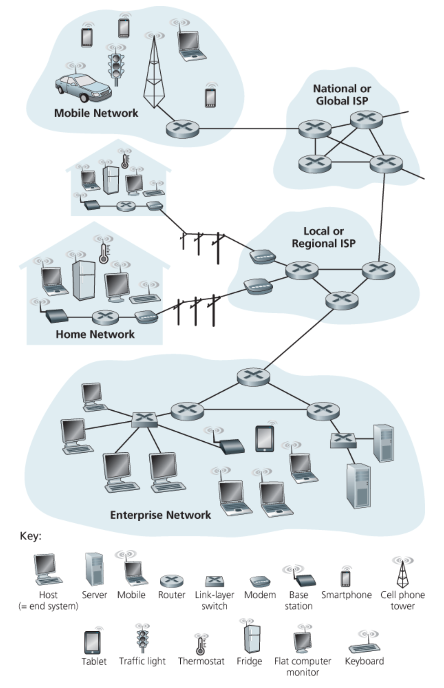

## Chapter Goal

- Look into a big picture of Computer Network
- Introduction to terminology

## Overview

- What is the Internet?
- What is a protocol?
- Network edge: hosts, access network, physical media
- Network core: packet/circuit switching, internet structure
- Performance: loss, delay, throughtput
- Protocol layers, service models
- Security
- History

### 1.1.1 A Nuts-and-Bolts Description

오늘의 날씨
