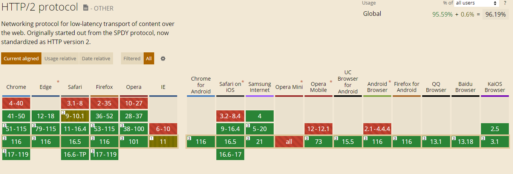

# HTTP/2로 전환

이곳 장에서는 HTTP/2로 전환하기로 결정을 하고 최종적으로 HTTP/2로 전환하기 위해서 고려해야할 사항에 대해서 설명해준다.

## 1. 브라우저의 지원

이미지에서 확인할 수 있듯이 대부분의 최신 브라우저에서는 HTTP/2 프로토콜을 지원하고 있다.

## 2. TLS 전환

모든 브라우저는 HTTPS 요청으로 HTTP/2에 접속하기 때문에 TLS의 지원을 하는 브라우저인지 여부도 중요하다.

## 3. HTTP/1.1 최적화 제거

기존 HTTP/1.1의 경우에는 서비스를 최적화 하기 위해서 다양한 기법들을 적용해왔지만 이런 기능들이 도리어 HTTP/2로 전환했을때 성능에 악영향을 끼치는 경우가 있다.

예를들어 번들링을 통해 프론트 코드를 합쳐 여러 네트워크 요청을 줄이기 위한 기법이 있다. 이를 HTTP2에서는 요청의 구조가 최적화 되어 개별 파일로 보냈을때 세밀한 브라우저 캐싱을 활용해 성능을 최적화 할 수 있는 경우가 있을 수 있다.

## 4. 서드파티

하나의 서비스에서 여러 서드파티를 활용하고 있다. 만일 서드파티 라이브러리가 TLS를 지원하지 않거나 HTTP2를 지원하지 않는 경우도 있을 수 있다.
HTTP1.1을 사용하거나 HTTP2로 변환을 해도 최적화가 되지 않는 라이브러리는 프로토콜의 버전업을 해도 성능상 이득은 변하지 않으므로 서드파티에 활용에 대해서 깊게 고민해보는게 좋을꺼 같다.

## 5. 예전 버전의 클라이언트 지원

HTTP2를 지원하지 않는 브라우저의 사용 비중이 높은 서비스라면 이에 대해서 HTTP2로 버전업을 할껀지 고민해보는게 좋다.
