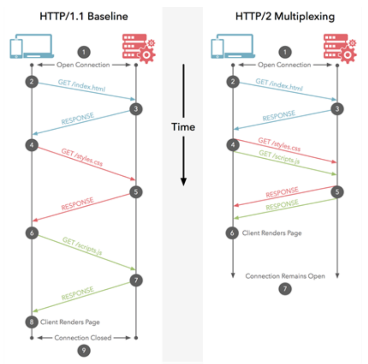
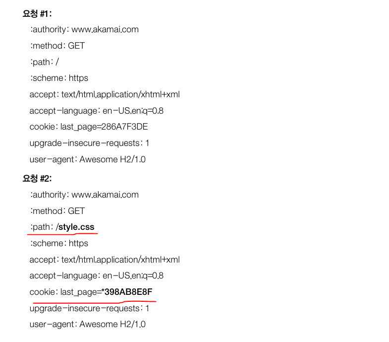
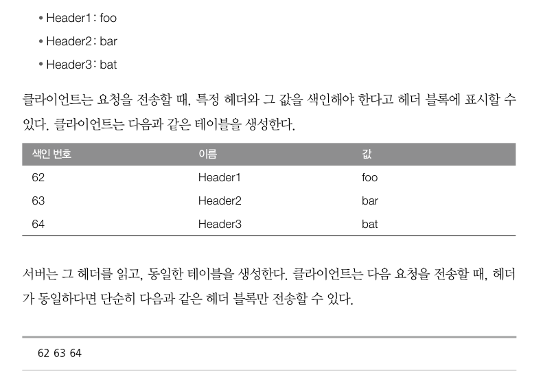
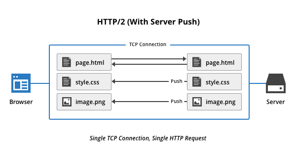

# HTTP2 프로토콜

이곳에서는 HTTP2의 전체 구조와 어떻게 동작하는지에 대해서 다루는거 같다.

## 용어설명

- 프레임: HTTP/2에서 통신의 최소 단위
- 메세지: 프레임을 여러개를 모아놓은것, 요청 응답의 단위
- 스트림: 양방향 통신을 통해 전달되는 한 개 이상의 메세지

즉 프레임이 모여 메세지가 되고 메세지가 모여 스트림이 된다.

### 멀티플렉싱

HTTP/1.1 

### 헤더 압축

HTTP1.1까지 발전하면서 헤더의 크기가 엄청 늘어나게 됐고 이에대한 압축의 필요성이 생기게 됐다. 

이 때 HTTP2는 HPACK 방식을 이용한다.

HPACK 방식이 어떤건지 간단하게 설명해보면

우리는 기본적으로 HTTP 요청을 할 때 두 요청에 밑줄친 부분만 다르고 다른부분은 모두 같은데 비효율적으로 중복된 데이터를 보내게 된다. 이를 해결하기 위해서 사용된 방식이 HPACK 방식이다. 

일단 맨 위에 세개의 요청을 보낸다고 가정을 하고 이에 대한 테이블을 위와같이 색인 번호를 부여해 생성한다. 
서버에서도 마찬가지로 똑같은 테이블을 생성을 한다. 그리고 이를 기반으로 이제 헤더를 다 요청보내는게 아닌 색인 번호만 서버로 보내 테이블 내용을 판단할 수 있도록 하는 압축 방법이다.  

### 서버 푸시

기존의 HTTP/1.1에서는 클라이언트에서 웹 사이트를 보고 싶으면 HTML을 요청하고 서버에서 응답을 받아서 다른 CSS는 JS를 재요청해 데이터를 받아오고 나서 렌더링이 됐다. 

하지만 서버 푸시는 처음 웹 사이트를 요청보냇을때 스타일과 이미지 리소스들이 어떤게 필요한지 기억해놨다가 다시 요청이 발생하면 요청을 할 필요없이 서버에서 먼저 리소스를 클라이언트에게 주는 방법이다. 이렇게 함으로서 요청이 새롭게 발생하지 않아 더 빠르게 서비스를 볼 수 있다.

