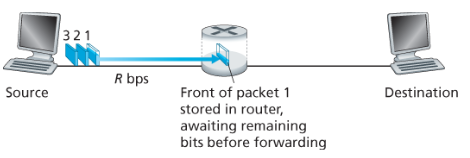

## 목차

[1.3.0 개요](#130-개요)  [1.3.1 패킷 교환](#131-패킷-교환)  [1.3.2 회선 교환](#132-회선-교환)  [1.3.3 네트워크의 네트워크](#133-네트워크의-네트워크) 

## 1.3.0 개요

목표:

- 네트워크 코어, 즉 인터넷의 종단 시스템을 연결하는 '패킷 스위치'들과 '링크'들의 연결망(mesh)을 좀 더 자세히 알아보자. 그림1-10의 굵은 선은 네트워크의 코어를 나타내고 있다.

## 1.3.1 패킷 교환

- 종단 시스템들은 서로 메시지를 교환하는데, 송신 종단 시스템에서 목적지 종단 시스템까지 메시지를 보낸다.
- 송신 시스템은 메시지를 `패킷 (packet)` 이라고 하는 작은 데이터 덩어리로 분할한다.
- 송신과 수신 측 사이에서 각 패킷은 `통신 링크`와 `패킷 스위치`(라우터와 링크계층스위치의 2가지 유형이 있음)를 거친다.

### 저장-후-전달 store-and-forward transmission

- 대부분의 패킷 스위치는 저장-후-전달 전송방식을 이용한다. 이는 스위치가 출력 링크로 패킷의 *첫 비트를 전송하기 전에 전체 패킷을 받아야 함*을 의미한다. 
- 라우터는 각 패킷의 비트를 먼저 저장(store)한 후 라우터가 패킷의 모든 비트를 수신한 후에만 출력 링크로 그 패킷을 전송(forward)하기 시작한다.

### 큐잉 지연과 패킷 손실

- 각 패킷 스위치는 접속된 여러개의 링크를 갖고 있다. 각 링크에 대해 패킷 스위치는 출력 버퍼(출력 큐)를 갖고 있고 그 링크로 송신하려고 하는 패킷을 저장하고 있다.
- 링크다 다른 패킷을 전송하고 있다면 도착하는 패킷은 출력 버퍼에서 대기해야한다. 저장-후-전달 지연 뿐 아니라 출력 버퍼에서 `큐잉 지연 (queuing delay)`을 겪는다.
- 버퍼의 공간의 크기가 유한하므로 패킷이 도착했을 때 출력 버퍼가 이미 가득 차 있는 경우 `패킷 손실 (packet loss)` 가 발생한다.

### 전달 테이블 forwarding table과 라우팅 프로토콜

- 패킷이 목적지 종단 시스템까지 도달하기 위해, 패킷 헤더에 목적지의 IP주소가 포함되어있다. 패킷이 라우터에 도착하면 라우터는 올바른 출력 링크에 맵핑하기 위해 `포워딩 테이블`을 검색한 후 그 패킷을 출력 링크로 보낸다.
- 5장에서 자세히 설명하겠지만 인터넷은 자동으로 포워딩 테이블을 설정하기 위해 이용되는 여러 라우팅 프로토콜을 갖고 있으며 각 라우터로부터 각 목적지까지의 최단 경로를 결정하고 이용한다.

## 1.3.2 회선 교환

- 앞서 살펴본 패킷 교환 이외에도 링크와 스위치의 네트워크를 통해 회선 교환 방식으로도 데이터를 이동시킬 수 있다.
- 회선 교환 네트워크의 예로 전화망과 같이 송신자와 수신자 간의 연결 상태가 유지되어야 하는 연결이다. 연결이 이루어지는 동안 네트워크 링크에 일정한 전송률을 예약하며 이는 송수신자로 하여금 보장된 일정 전송률로 데이터를 보낼 수 있게 한다.
- <패킷 교환 반대자>   가변적이고 예측할 수 없는 종단간의 지연 떄문에 실시간 서비스(전화, 비디오 통화)에는 적당하지 않다고 주장한다.
- <패킷 교환 옹호자>  
  1. 패킷교환이 회선교환보다 전송 용량의 공유에서 더 효율적이다 -> 패킷교환은 요구할 때만 링크의 사용을 할당하기 때문
  2. 회선교환보다 구현 비용이 더 적다

## 1.3.3 네트워크의 네트워크

무수한 종단 시스템의 인터넷 연결과 사용을 위해 종단 사용자들과 콘텐츠 제공자들은 각각의 접속 ISP로 연결되어야만 한다. 모든 종단 시스템이 서로에게 패킷을 보낼 수 있도록 접속 ISP를 연결하는 네트워크의 네트워크가 발생했다. 오늘날의 인터넷 구조를 이해하기 위해 일련의 네트워크 구조를 만들어서 설명할 수 있다.

1. 네트워크 구조 1  모든 접속 ISP들을 하나의 (임의의)글로벌ISP와의 연결을 가정할 수 있다. (상상의) 글로벌ISP는 수십만개의 접속ISP와 각각의 라우터 그리고 통신 링크의 네트워크이다. 이를 구축하기 위해서는 매우 많은 비용이 든다. 여기에서 접속ISP가 글로벌ISP에게 요금을 지불해야하기 때문에 접속ISP는 고객이고 글로벌ISP는 제공자이다.
2. 네트워크 구조 2  다중의 글로벌ISP 제공자가 등장하며, 서로 다른 고객(접속ISP)끼리 통신할 수 있도록 글로벌ISP 또한 서로 연결해야만 한다. 이 구조는 2-계층 구조이다. 전 세계 모든 지역에 서비스하는 글로벌ISP는 없다. 따라서 지역에 있는 접속ISP들이 연결하는 지역ISP가 있으며 이들은 1-계층(tier-1) ISP들과 연결된다. 1-계층 ISP는 (상상의) 글로벌ISP와 유사하다. 대략적으로 12개 정도의 1-계층ISP가 있다.
3. 네트워크 구조 3  이러한 계층 구조 속에서 접속ISP는 자신이 연결하는 지역ISP에게 요금을 지불하고 각 지역ISP는 자신이 연결하는 1-계층 ISP에게 요금을 지불한다. 따라서 계층구조의 각 레벨에 고객-제공자 관계가 있다. 이 다중 계층구조는 오늘날의 인터넷과 대략적으로 유사하다.
4. 네트워크 구조 4  오늘날의 인터넷과 보다 더 유사한 네트워크를 구축하기 위해 몇가지를 더 추가할 수 있다. 
   - PoP (points of presence)   최하위(접속ISP) 계층을 제외한 제공자의 네트워크 내에 있는 하나 혹은 그 이상의 라우터 그룹이다. 
   - Multi-home   최상위(1-계층)ISP를 제외한 ISP가 둘 혹은 그 이상의 제공자 ISP에 연결하는 것을 말한다. 
   - Peering   트래픽 양에 따라 지불하는 비용을 줄이기 위해 같은 계층에 있는 가까운 ISP 끼리 피어링하여 상위계층 ISP를 통하지 않고 직접 송수신 할 수 있다. 
   - IXP (Internet Exchange Point)   제 삼자의 회사가 구축할 수 있으며 다중의 ISP들이 서로 피어링 할 수 있는 장소라고 할 수 있다.  
5. 네트워크 구조 5  이는 네트워크 구조 4 위에 콘텐트-제공자 네트워크(content-provider network)를 추가함으로써 구축한다. 현재 구글이 이러한 예이며 구글의 전세계에 분산된 데이터 센터들은 모두 구글의 사설 TCP/IP 네트워크를 통해 연결되어 있다. 가능한 곳에서 하위 계층 ISP들과 직접 연결한다.
