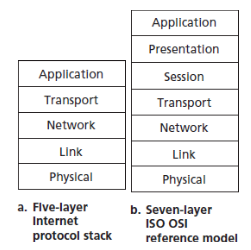
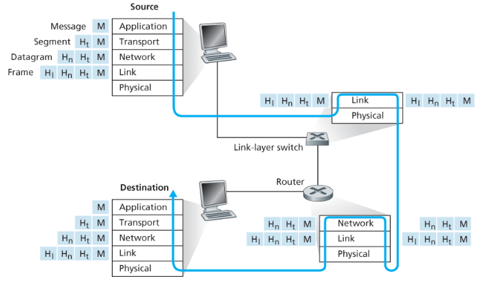

## 목차

[1.5.0 개요](#150-개요)  [1.5.1 계층구조](#151-계층구조)  [1.5.2 캡슐화](#152-캡슐화) 

## 1.5.0 개요

목표:

- 네트워크 구조의 조직에 대해 알아보자

---

## 1.5.1 계층구조

각 계층은 하위 계층과 연계하여 서비스를 구현, 제공한다.

### 프로토콜 계층화

네트워크 프로토콜의 설계에 대한 구조를 제공하기 위해, 네트워크 설계자는 프로토콜(프로토콜을 구현하는 네트워크 하드웨어와 스포트웨어)을 계층(layer)으로 조직한다. 계층화는 시스템 구성요소에 대해 논의하기 위한 구조화된 방법을 제공한다(RFC 3439). 다양한 계층의 프로토콜을 모두 합하여 프로토콜 스택(protocol stack) 이라고 한다. 인터넷 프로토콜 스택은 5개의 계층으로 구성된다.

### 애플리케이션 계층

- 인터넷의 애플리케이션 계층은 HTTP, SMTP, FTP 같은 많은 프로토콜을 포함한다.
- 대부분 종단 시스템의 소프트웨어로 구현된다.
- 애플리케이션 계층에서의 정보 패킷을 메시지라고 부른다.

### 트랜스포트 계층

- 인터넷에는 TCP, UDP 트랜스포트 프로토콜이 있으며 클라이언트와 서버 간에 애플리케이션 계층 메시지 전송하는 서비스를 제공한다.
- 트랜스포트 계층 패킷을 세그먼트라고 한다.
- TCP
  - 애플리케이션에게 연결지향형 서비스 제공
  - 메시지 전달 보장 (신뢰성)
  - 흐름제어 (송신자, 수신자 속도 일치)
  - 긴 메시지를 짧은 메시지로 나누고 혼잡제어 기능 제공
  - 네트워크 혼잡할 때 출발지의 전송속도를 줄이는 기능
- UDP
  - 애플리케이션에게 비연결형 서비스 제공
  - 신뢰성, 흐름제어, 혼잡제어 기능 미제공

### 네트워크 계층

- 출발지 호스트에서 인터넷 트랜스포트 계층 프로토콜(TCP or UDP)은 세그먼트와 목적지 주소를 네트워크 계층으로 전달한다. 그 다음에 네트워크 계층은 목적지 호스트의 트랜스포트 계층으로 세그먼트를 운반하는 서비스를 제공한다.
- 인터넷의 네트워크 계층은 한 호스트에서 다른 호스트로 데이터그램 datagram 을 라우팅하는 책임을 진다.
- 인터넷의 네트워크 계층은 2가지 주요 요소를 갖는다. 이 계층은 **IP 데이터그램의 필드를 정의**하며 종단 시스템과 라우터가 **이 필드에 어떻게 동작하는지를 정의하는 프로토콜**을 갖고 있다. 이 프토콜이 `IP프로토콜`이다. 오직 하나의 IP 프로토콜이 있고 네트워크 계층을 가진 모든 인터넷 요소는 IP 프로토콜을 수행해야만 한다.
- 인터넷 네트워크 계층은 출발지와 목적지 사이에서 데이터그램이 이동하는 경로를 결정하는 라우팅 프로토콜을 포함한다. 인터넷은 많은 라우팅 프로토콜을 갖고 있다.

### 링크 계층

- 인터넷의 네트워크 계층은 출발지와 목적지간 패킷 스위치를 통해 데이터그램을 라우트 하는데 한 노드에서 다른 노드로 패킷을 이동시키기 위해 링크 계층 서비스에 의존해야한다. 네트워크 계층으로부터 받은 데이터그램을 링크 계층은 경로상의 다음 노드에 전달한다. 다음 노드에서 링크 계층은 그 데이터그램을 상위 네트워크 계층으로 보낸다.
- 링크계층 프로토콜의 예로는 이더넷, 와이파이, 케이블 접속 네트워크의 DOCSIS 프로토콜을 들 수 있다. 데이터그램이 목적지까지의 여러 링크를 거치므로 경로상 서로 다른 링크에서 다른 링크 계층 프로토콜에 의해 처리될 수 있다.
- 링크 계층 패킷은 프레임 frame 으로도 불린다.

### 물리 계층

- 링크 계층의 기능이 전체 프레임을 한 네트워크 요소에서 이웃 네트워크 요소로 이동하는 것이라면 물리 계층의 기능은 프레임 내부의 각 비트를 한 노드에서 다음 노드로 이동하는 것이다. 이 계층의 프로토콜은 링크에 의존하고 더 나아가 링크의 실제 전송 매체 (예: 꼬임쌍선, 단일 모드 광케이블)에 의존한다. 각각의 물리매체 마다 다른 방식으로 비트가 링크 반대편으로 이동한다.

### OSI 모델

링크 계층의 기능이 전체 프레임을 한 네트워크 요소에서 이웃 네트워크 요소로 이동하는 것이라면 물리 계층의 기능은 프레임 내부의 각 비트를 한 노드에서 다음 노드로 이동하는 것이다. 이 계층의 프로토콜은 링크에 의존하고 더 나아가 링크의 실제 전송 매체 (예: 꼬임쌍선, 단일 모드 광케이블)에 의존한다. 각각의 물리매체 마다 다른 방식으로 비트가 링크 반대편으로 이동한다.

- 프레젠테이션 계층  이 계층의 역할은 통신하는 애플리케이션들이 교환되는 데이터의 의미를 해석하도록 하는 서비스를 제공한다. 이들 서비스는 데이터 기술뿐만 아니라 데이터 압축과 데이터 암호화를 포함한다.
- 세션 계층  데이터 교환의 경계와 동기화를 제공하는데, 이에는 체킹포인트와 회복방법을 세우는 수단을 포함한다.

## 1.5.2 캡슐화

각기 계층마다 헤더와 세그먼트, 데이터그램, 프레임을 만들어 캡슐화를 진행하고 목적지에서 역캡슐화 과정을 거친다. 캡슐화는 신뢰하지 않는 네트워크로부터의 안전과 유연성과 확장성의 증가, 네트워크 오버헤드를 줄인다.
