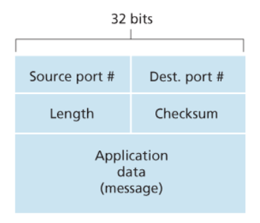

# UDP

## 동작 순서

1. 어플리케이션 계층으로부터 메세지를 받아와서 출발지 포트번호 도착지 포트 번호 필드를 첨부한다.
2. 출발지의 IP주소, 도착지의 IP주소를 필드에 추가하고 세그먼트를 네트워크 계층으로 넘겨준다.
3. 네트워크 계층은 받은 세그먼트를 IP 데이터그램으로 캡슐화하여 수신 호스트에게 전달한다.
4. 수신 호스트에 세그먼트가 도착하면 내용안에 있던 목적지 포트번호를 이용해 수신 측의 어플리케이션 계층에 있는 프로세스로 전달한다.

## UDP의 장점

- 통신하는 시간이 빠르기 때문에 실시간 통신이 가능해 무슨 데이터를 언제 보낼지에 대해서 더 정교한 제어가 가능하다. 
  어플리케이션에 데이터를 UDP에 전달하자마자 추가 작업없이 바로 세그먼트를 만들어 네트워크 계층으로 전달한다.
- 3-way-handshake 등의 추가 과정이 없어 연결 설정을 하기위한 추가적인 지연이 없다.
- 연결의 상태를 유지하지 않는다. 
- TCP보다 작은 크기의 패킷을 유지한다. 

## UDP의 단점

- 혼잡제어를 하지 않는다.

여기서 혼잡제어는 패킷의 양이 많아져 하나의 라우터에서 처리해야할 패킷의 수가 많아지면 그 만큼 패킷의 손실로 이어질 수 있다. 패킷의 손실만큼 지속적으로 재전송을 하게 되고 네트워크는 더욱 많은 패킷이 몰리게 되는데 이를 송신측의 전송속도의 제어로 예방할 수 있는데 이를 혼잡제어라고 한다.

- 비신뢰성있는 서비스를 제공한다. 
하지만 요즘에는 어플리케이션 자체에서 신뢰성을 제공해 이를 보완하는 방법으로 UDP가 각광 받고 있다.

이를 위해 UDP를 개조한 QUIC 프로토콜이 HTTP/3.0에서 사용되고 있다.

## UDP 세그먼트 구조

출발지와 목적지의 포트번호가 들어있고 세그먼트의 길이 데이터도 있다. 
checksum이라는게 있는데 이는 전송된 세그먼트의 에러를 탐지하기 위해서 사용된다.

그림에 위에 4개가 Header를 의미한다.

### 체크섬

체크섬은 전송된 데이터가 변형이 되지 않았는지 확인하는 값이다. 
간단한 메커니즘은 전송하려는 세그먼트 값들을 이용해 체크섬을 만들어 세그먼트에 담아서 전송하고 세그먼트를 받은 상대는 세그먼트 값들을 이용해 다시 체크섬을 계산에 저장된 체크섬 값과 비교를 한다. 

하지만 확률은 적지만 만약 중간에 변형된 값의 기존 체크섬 값과 동일한 경우도 있을 수 있다. 
