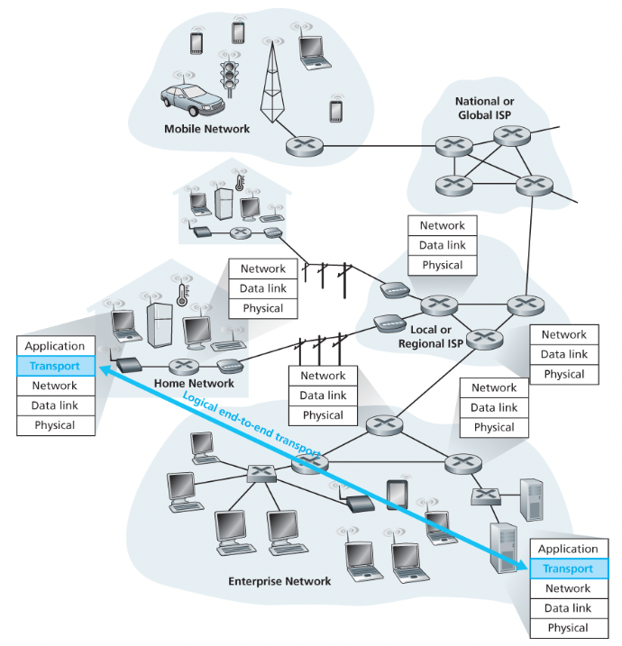

## 목차

[3.1.0 개요](#310-개요)  [3.1.1 트랜스포트 게층과 네트워크 계층 사이의 관계](#311-트랜스포트-게층과-네트워크-계층-사이의-관계)  [3.1.2 인터넷 트랜스포트 계층의 개요](#312-인터넷-트랜스포트-계층의-개요) 

## 3.1.0 개요

트랜스포트 계층에 대한 앞선 내용을 간략히 말하자면, 트랜스포트 계층 프로토콜은 서로 다른 호스트에서 동작하는 애플리케이션 **프로세스들 간의 논리적 통신** (logical communication)을 제공한다. 논리적 통신은 애플리케이션의 관점에서 보면 프로세스들이 동작하는 호스트들이 직접 연결된 것처럼 보인다는 것을 의미한다. 애플리케이션 프로세스는 메시지 운반에 사용되는 물리적인 하위 구조의 세부사항에 상관없이 서로 메시지를 송신하기 위해서 트랜스포트 계층에서 제공하는 논리적 통신을 사용한다.

네트워크 애플리케이션에는 하나 이상의 트랜스포트 계층 프로토콜이 사용 가능하다. 예를 들어, 인터넷은 TCP와 UDP라는 두 가지 프로토콜을 가지고 있다. 이러한 프로토콜은 서비스를 요청하는 애플리케이션에게 트랜스포트 계층에서 서로 다른 서비스 집합을 제공한다. 

## 3.1.1 트랜스포트 게층과 네트워크 계층 사이의 관계

트랜스포트 계층 프로토콜은 서로 다른 호스트에서 동작하는 **프로세스들 사이의 논리적 통신**을 제공하지만, 네트워크 계층 프로토콜은 **호스트들 사이의 논리적 통신**을 제공한다.

트랜스포트 계층 프로토콜은 종단 시스템에 존재한다. 종단 시스템 안에서, 트랜스포트 프로토콜은 애플리케이션 프로세스에서 네트워크 경계(즉 네트워크 계층)까지 메시지를 운반하며 또한 반대 방향으로 네트워크 계층에서 애플리케이션 프로세스로 메시지를 운반한다.

트랜스포트 계층이 제공할 수 있는 서비스는 하위 네트워크 계층 프로토콜의 서비스 모델에 의해서 제약받는다. 만약 네트워크 계층 프로토콜이 호스트 사이에서 전송되는 트랜스포트 계층 세그먼트에 대한 지연 보장이나 대역폭 보장을 제공할 수 없다면 트랜스포트 계층 프로토콜은 프로세스끼리 전송하는 메시지에 대한 지연 보장이나 대역폭 보장을 제공할 수 없다. 그럼에도 불구하고 하위 네트워크 프로토콜이 상응하는 서비스를 제공하지 못할 때에도 특정 서비스는 트랜스포트 프로토콜에 의해서 제공될 수 있다.

## 3.1.2 인터넷 트랜스포트 계층의 개요

인터넷, 좀더 일반적으로 TCP/IP 네트워크는 애플리케이션 계층에게 두 가지 구별되는 트랜스포트 계층 프로토콜들을 제공한다는 것을 배웠다. 하나는 애플리케이션에게 비신뢰적이고 비연결형인 서비스를 제공하는 UDP이고 다른 하나는 신뢰적이고 연결지향형 서비슬 제공하는 TCP이다. 네트워크 애플리케이션을 설계할 떄 개발자는 이 두가지 중의 하나를 명시해야한다. 개발자는 소켓을 생성할 때 TCP와 UDP 중에서 하나를 선택해야 한다.

IP 서비스 모델은 호스트들 간에 논리적 통신을 제공하는 최선형 전달 서비스 (best-effort delivery service) 이다. IP는 세그먼트의 전달을 보장하지 않고 세그먼트가 순서대로 전달되는 것을 보장하지 않는다. 또한 IP는 세그먼트 내부 데이터의 무결성 (integrity)을 보장하지 않는다. 이러한 이유로 IP를 비신뢰적인 서비스라고 부른다.

IP 서비스 모델을 간단히 살펴보았으므로 UDP와 TCP의 서비스 모델을 살펴보자. 이 둘의 가장 기본적인 기능은 종단 시스템 사이의 IP 전달 서비스를 종단 시스템에서 동작하는 두 프로세스 간의 전달 서비스로 확장하는 것이다.

> “호스트-대-호스트 전달”을 “프로세스-대-프로세스 전달”로 확장하는 것을 트랜스포트 다중화 (transport multiplexing)와 역다중화 (demultiplexing)라고 부른다.

다음 절에서 다중화와 역다중화를 살펴볼 것이다.

UDP와 TCP는 헤더에 오류검출필드를 포함함으로써 무결성 검사를 제공한다. 이러한 최소한의 두가지 서비스 (데이터 전달과 오류검출)가 UDP가 제공하는 유일한 서비스이다. 반면에 TCP는 애플리케이션에 몇 가지 추가적인 서비스를 제공한다.

- 신뢰적인 데이터 전달 reliable data transfer 을 제공한다.
  흐름제어, 순서 번호, 확인응답, 타이머를 사용함으로써 송신하는 프로세스로부터 수신하는 프로세스에게 데이터가 순서대로 정확하게 전달되도록한다. 이처럼 TCP는 IP의 비신뢰적인 서비스를 프로세스 사이의 신뢰적인 데이터 전송 서비스로 만들어준다.
- 혼잡제어 congestion control 을 제공한다.
  혼잡제어는 인터넷에 대한 통상적인 서비스같이 애플리케이션이 야기 시켜서 제공되는 특정 서비스가 아니라 전체를 위한 일반 서비스이다. 곧, 한 TCP 연결이 과도한 양의 트래픽으로 모든 통신하는 호스트들 사이의 스위치와 링크를 폭주되게 하는것을 방지하는 것이 TCP 혼잡제어이다. 혼잡한 네트우커ㅡ링크에서 각 TCP 연결이 링크의 대역폭을 공평하게 공유하여 통과하도록 해준다. 이것은 송신 측의 TCP가 네트워크에 보낼 수 있는 트래픽을 조절함으로써 수행된다.

이러한 서비스들을 제공하는 TCP는 복잡할 수 밖에 없다. 이들 내용은 3.4~3.8에서 다룰 것이다.
