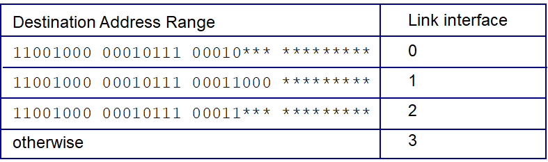

# 라우터 내부에는 무엇이 있을까?

## 4.1.0 개요

### 라우터 내부 구조

라우터 내부 구조에 대해서 간략하게 설명드리고 시작하겠습니다.

1. 입력 포트: 데이터 패킷이 라우터로 수신될 때, 라우터의 입력 포트를 통해서 수신됩니다. 그리고 입력 포트는 라우팅 알고리즘을 통해서 결정된 포워딩 테이블을 참조하여 특정 출력 포트로 데이터 패킷을 전달할 수 있도록 **링크 계층 역할** 을 수행합니다.
2. 출력 포트: 스위칭 구조에서 수신된 패킷을 출력 링크로 패킷을 전송하는 역할을 수행합니다.
3. 라우팅 프로세서: 이에 대해서는 **전통적인 네트워크 계층** 과 **SDN** 관점에서 조금의 차이가 존재합니다. 전통적인 네트워크 계층에서는 각 라우터 내부에서 라우팅 프로세서가 존재하여, 라우팅 프로세서에서 라우팅 알고리즘을 통래서 라우팅을 수행한 뒤 포워딩 테이블을 갱신하는 역할을 수행합니다. SDN의 경우에는 제어 평면의 원격 컨트롤러에서 라우팅 알고리즘을 통해 라우팅을 계산하고, 각 라우터는 원격 컨트롤러와 상호작용하여 계산된 정보를 통해서 각 라우터의 포워딩 테이블을 갱신하는 방식으로 동작합니다.

## 4.1.1 입력 포트 처리 및 목적지 기반 전달

위의 그림은 각 라우터에 존재하는 포워딩 테이블입니다. 라우터는 42억개 가량의 IP 주소를 대상으로 출력 포트를 결정하는 방식이 아닌, **Longest Prefix Matching** 방식을 이용해서 특정 목적지 IP 주소를 prefix 규칙과 비교하여 출력포트를 결정합니다.