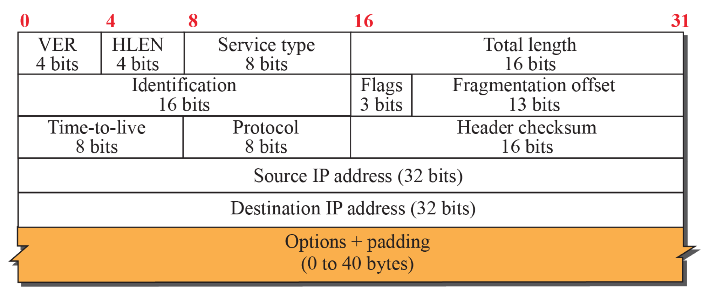

# 인터넷 프로토콜(IP): IPv4, 주소 지정

## 4.3.1 IPv4 데이터그램 형식

해당 부분은 그림만 보여드리고, 간략하게 설명드리고 넘어가고자 합니다.

## 4.3.3 IPv4 주소체계

우선 각 IP 주소는 32비트의 길이를 가진다는 것을 언급하고 시작하겠습니다. 따라서 대략 40억 개의 IPv4 주소가 존재할 수 있습니다.

이 주소는 일반적으로 10진 표기법으로 사람에게 보여지는데, 예시로 **193.32.216.9** 라는 주소를 들어보겠습니다.

앞에서부터 각각의 노테이션은 32비트에서 8자리 씩을 의미하는데, 193의 경우 아이피 주소의 첫번째 8자리와 일치합니다. 즉, 사람이 아닌 기계가 보는 해당 IP 주소는 아래와 같습니다. 

**11000001 00100000 11011000 00001001**

그리고 전세계 인터넷에서 모든 호스트와 라우터의 각 인터페이스는 고유한 IPv4 주소를 가져야합니다. (물론 현재는 모든 호스트와 라우터가 아닌, NAT 뒤의 인터페이스들은 제외한 네트워크 계층의 장비들로 범위가 수정되어있습니다)

### 서브넷과 서브넷 마스크 -> 중요

서브넷과 서브넷 마스크에 대해서 설명을 드리고자합니다.

해당 그림에서, 각 두 호스트들은 모두 라우터의 연결 없이 하나의 묶음으로 되어있는 것을 확인해볼 수 있습니다. 여기서 그 묶음을 네트워크 용어로 **서브넷(subnet)** 이라고 부릅니다.

그리고 서브넷에는 서브넷 마스크(subnet mask) 라는 것이 존재하여, 서브넷에 소속된 모든 네트워크 장비에 특정 대역의 IP 주소를 가지도록합니다.

해당 예시에서 Subnet 1을 보자면, Subnet 1은 200.200.10.48/29 라는 subnet mask를 가지는 것을 확인할 수 있습니다. 해당 서브넷 마스크는 아래의 IP 주소들이 Subnet 1에 소속됨을 알립니다.

> **11001000 11001000 00001010 00110xxx**

책에서 소개하는 서브넷의 정의를 언급하며 다음 이야기로 넘어가겠습니다.

> 서브넷을 결정하려면 먼저 호스트나 라우터에서 각 인터페이스를 분리하고 고립된 네트워크를 만든다. 이 고립된 네트워크의 종단점은 인터페이스의 끝이 된다. 이렇게 고립된 네트워크 각각을 **서브넷** 이라 부른다.

### CIDR 표기법 -> 이것도 중요

사실 서브넷 마스크를 설명하면서 CIDR 노테이션을 알게모르게 사용했습니다. 200.200.10.48/29 가 CIDR 표기법을 통해서 IPv4 address의 range를 표현한 것인데요, 위의 CIDR을 분석해보면서 설명드리겠습니다.

x.x.x.x/y 의 의미는, 앞에서 y자리 까지는 x.x.x.x 의 prefix를 따르고, y자리 이후로는 정해지지 않았음을 의미합니다. 즉, y자리 이후로는 자유롭게 올 수 있기에 해당 범위에 존재하는 모든 ip 주소들은 cidr에 소속될 수 있음을 의미하기도합니다.

예를 들어, 200.200.10.48의 경우 바이너리로 전환하면 **11001000 11001000 00001010 00110000** 이고, 29자리 까지 prefix로 가지기 때문에 뒤의 000 자리는 아무거나 들어올 수 있습니다.

> **11001000 11001000 00001010 00110xxx**

즉, **11001000 11001000 00001010 00110101** 도 해당 cidr에 소속될 수 있고, **11001000 11001000 00001010 00110001** 도 해당 cidr에 소속될 수 있음을 의미합니다.

### CIDR 표기법 이전의 세상 -> 이건 참고만 하시면 됩니다.

CIDR 표기법 이전에는 IPv4 주소체계를 A, B, C class로 분류했었습니다. 그리고 각각은 cidr로 따지만 뒤의 자리가 각각 8, 16, 24 였습니다.

이는 네트워크 세계에서 불공평을 야기했기에, 해당 abc classification은 현재 폐기되었고, cidr 블록 방식으로 ip주소 체계를 분류하는 방식으로 전환되었습니다.

### DHCP

제 컴퓨터가 다른 컴퓨터와 컴퓨터 네트워크를 통해 상호작용하기 위해서는 IP 주소를 ISP로부터 할당받을 필요가 있습니다. ISP는 ip 주소의 할당에 대한 효율성을 위해 각 호스트에 고정적으로 ip 주소를 할당하는 방식보다는, 동적으로 ip 주소를 할당하는 방식을 채택합니다.

그리고 이러한 ip 주소의 동적 할당을 위해서 **DHCP** 라는 네트워크 계층 프로토콜을 두는데, 이 프로토콜을 통해 각 호스트에게 배정되는 ip 주소, 서브넷 마스크 정보, gateway 주소, local dns 주소 등을 부여합니다.

### NAT (Network Address Translation) -> 이거 중요함

앞서 언급했듯이, ipv4 주소체계는 대략 40억개의 주소를 할당할 수 있다고 말씀드린 바 있습니다. 하지만 현재 세계는 40억개를 훨씬 상회하는 개수의 네트워크 계층의 장비가 존재하기에, ipv4 주소는 기존의 체계로는 고갈이 되었을겁니다. 하지만 저희는 ipv6가 아닌 ipv4 주소 체계를 아직도 사용중인데요, 이걸 가능하게하는 이유가 NAT에 존재합니다.

각 호스트는 ISP로부터 직접 네트워크에 참여하는 주소를 할당받는 방식이 아니라, 사설 ip(private ip)를 부여받습니다. 그리고 호스트가 다른 호스트와 컴퓨터 네트워크 통신을 할때는 private ip를 기재하여 데이터 패킷을 전송하고, NAT gateway에 대응하는 라우터는 해당 private ip를 public ip로 치환하고, 해당 치환 정보를 gateway에 기재합니다. 그러한 로컬한 치환 방식을 통해서 ipv4 주소의 고갈을 막는 방식이 NAT이며, 흔히 이러한 NAT 내부망을 **사설망** 이라고도 부르기도합니다.